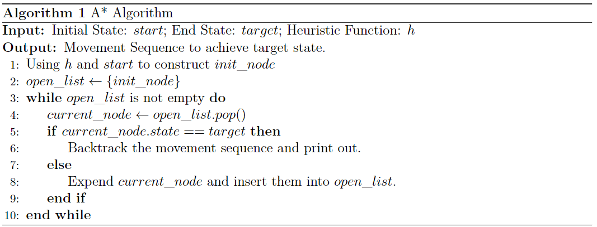
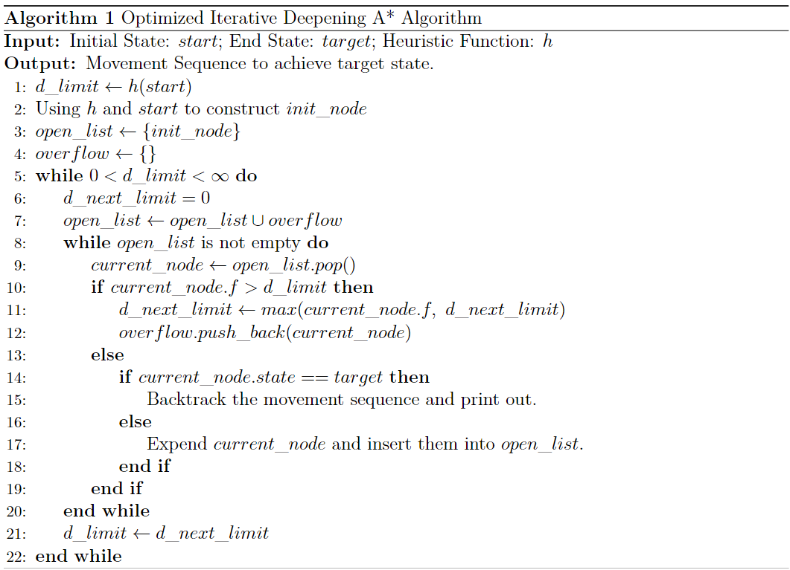
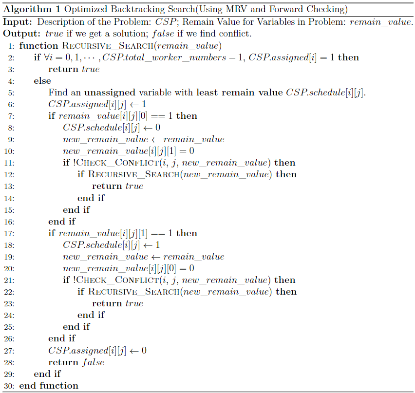
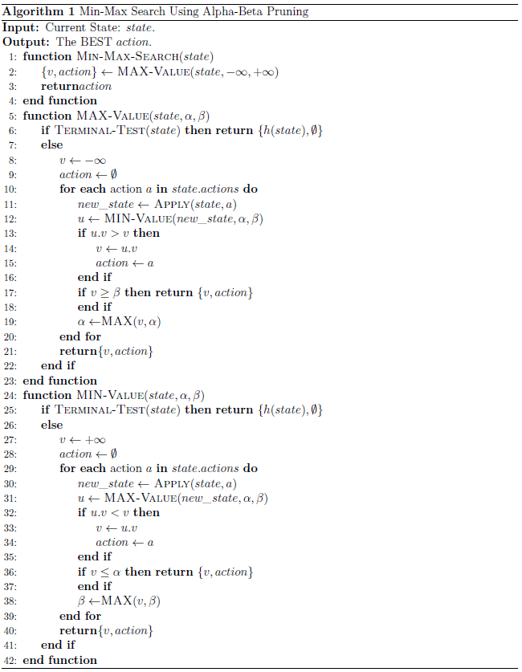

# 基于搜索的AI算法

在AI领域, 有很多算法都是基于搜索来实现的, 本文件夹将介绍三种常见的AI领域的搜索算法, 并用它们来解决实际问题。

## A*搜索

### 算法介绍

A\*搜索是深度优先搜索的一种改进, 它利用了领域内的先验知识来改进搜索效率。具体来说, A\*搜索会根据一个cost的估计值`f`来决定访问节点的顺序, `f`是过往搜索的结果`g`加上启发式函数对将来的估计`h`得到的, 在实际操作中, 我们会对每一个搜索到但还未访问的节点计算`f`, 并将其插入到由**优先队列**构成的`open_list`中, 每次搜索选择`open_list`中的首个元素(也即`f`最小的节点)进行扩展, 然后对扩展的节点计算f并插入到`open_list`中,如此迭代, 直到找到目标状态。

[A_star](./A_star/)文件夹中就是利用A\*算法解决8数码问题的拓展——24数码问题的例子, 算法的伪代码如下:

 

除此以外, 工程上还有一种迭代加深的A\*算法, 迭代A\*算法是基于A\*算法和迭代加深的深度优先搜索算法改进而来, 其基本思想是每轮迭代限定一个迭代深度(用`f=g+h`来衡量), 若遇到节点的f大于限制, 则更新下一轮的“深度”限制, 否则按照基本的A\*算法进行节点的拓展, 若在该“深度”限制下已无节点, 则利用之前求得的下一轮深度重新开始迭代, 直到找到解。算法的基本框架如下:

### 代码使用

- **A_star.h**: A*算法的头文件, 主要定义了一些必要的数据结构;
- **A_star.cpp**: A*算法的具体实现, 根据输入的`input.txt`和`target.txt`计算移动序列, 同时输出到终端和文件`output.txt`中;
- **IDA_star.cpp**: 迭代加深的A*算法的具体实现, 根据输入的`input.txt`和`target.txt`计算移动序列, 同时输出到终端和文件`output.txt`中;
- **TestDataGen.cpp**: 测试集生成, 结果保存在当前目录下的`input.txt`和`target.txt`中;
- **CheckAnswer.cpp**: 读入`input.txt`、`target.txt`和`output.txt`检测结果是否正确;
- **Makefile**: 编译执行脚本.

`cd`到代码文件目录下, 在命令行输入`make`即可完成编译得到可执行文件`A_star`和`IDA_star`并生成随机数据集`input.txt`和`target.txt`, 执行`make check`则会编译执行可执行文件并把得到的结果作为输入传递给`CheckAnswer`进行检查, 若结果正确则会输出`Pass`.

## CSP问题

### 算法及问题描述

约束满足问题(`Constraint Satisfaction Problems`)是一种数学的问题, 其定义为给定一组变量(`variables`)、其对应的取值集合(`domains`), 以及这些变量需要满足一些限制条件, 求出一种可能的满足约束的赋值。这类问题可以使用搜索的办法求解, 最简单的思路是`Backtracking Search`, 为了提高搜索效率, 我们可以加入启发式的思想, 比如利用最少剩余赋值的原则选取未被赋值的变量优先进行赋值、使用前向检验来及早判断冲突提前剪枝等。

我们在[CSP](./CSP/)文件夹内实现了一个带有一定量启发式思想的`Backtracking Search`算法来解决工人排班问题, 该问题定义如下:

在一个车间中，共有`n`名工人：工人1，工人2， ...， 工人n，每个工人根据工作年限都有自己的级别，比如工人1的级别是: `senior`，工人2的级别是: `junior`，现在需要`n`名工人设计一个工作表，比如将工人1和工人2安排到星期一，工人3和工人4安排到星期二，... ，对于车间的工作安排，有以下`5`条约束要求:

- 每个工人每周必须休息`2`天或`2`天以上;
- 每个工人每周不可以连续休息`3`天(不考虑跨周情况);
- 每天至少要有`m`(m < n)个人值班(一周七天都要);
- 每天至少要有一名级别为`senior`的工人值班;
- 存在不想在一起值班的人, 它们不能被安排在同一天值班。

我们对该问题进行建模, 将变量设为每个工人每天被安排值班的情况, 于是共有`n * 7`个变量且变量的值域为`0`和`1`(`0`表示不值班, `1`表示值班), 该问题利用`Backtracking Search`的框架求解的伪代码如下:

### 代码说明

- **CSP.h**: 算法的头文件, 主要定义了一些必要的数据结构;
- **CSP.cpp**: 算法的具体实现, `main`函数中定义了一个10个人的排班问题示例, 直接运行可以按每天输出值班员工编号。

## Min-Max搜索

### 算法介绍

`Min-Max Search`是用于解决两人零和博弈问题的有效手段, 它还能通过`Alpha-Beta`剪枝来进一步优化性能, 算法的伪代码如下:

 

[Min-Max](./Min-Max/)文件夹内实现了一个使用`Min-Max Search`算法和启发式函数构建的五子棋`AI`, 启发式函数主要思想为: 首先遍历整个棋盘, 对存在棋子的位置统计以它为中心四个方向(横向、纵向、对角线、反对角线)长为`9`的棋局状态, 之所以长为`9`是因为这个棋子最多能影响周围9个格子范围内的棋子; 接下来查询字串, 按照**成五、活四、冲四、单活三、跳活三、眠三、活二、眠二**的模式匹配, 并赋以不同权值; 接着, 通常来说棋子下在越靠近中间越有利, 所以我们给棋盘的每个格点赋一个权重并将前一步得到的值乘上该权重, 计算函数为`MAXN / 2 - max(abs(x - MAXN / 2), abs(y - MAXN / 2))`, 其中`(x, y)`为坐标, `MAXN`为棋局的大小。最后, 将自己所有棋子的权值相加, 减去对手棋子计算的权值之和, 得到对棋盘的估计值。

### 代码说明

- **MinMaxSearch.h**: 算法的头文件, 主要定义了一些必要的数据结构, 可以通过宏定义`MAXN`调整棋局大小, `MAX_DEPTH`调整AI迭代深度;
- **MinMaxSearch.cpp**: 算法的具体实现, 运行该代码可直接开始游戏, 总是用户先手。

